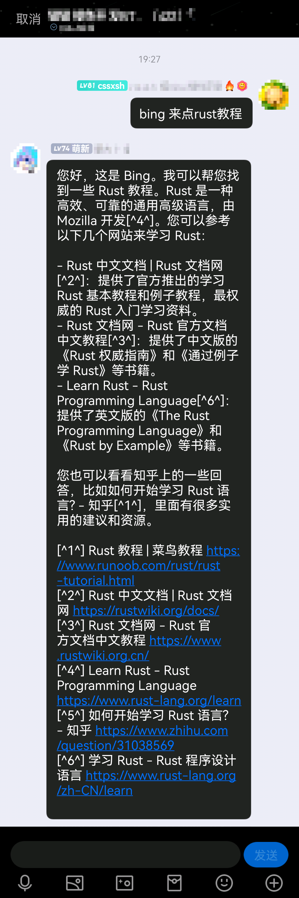

# [Mirai New Bing](https://github.com/cssxsh/mirai-new-bing)

> 基于 Mirai Console 的 New Bing Chat Bot 插件

**使用前应该查阅的相关文档**

*   [User Manual](https://github.com/mamoe/mirai/blob/dev/docs/UserManual.md)
*   [Permission Command](https://github.com/mamoe/mirai/blob/dev/mirai-console/docs/BuiltInCommands.md#permissioncommand)

由于微软还未在中国大陆开放 `New Bing` 的使用，以国内IP去访问 `Bing` 会导致跳转 `404` 而无法使用  
~~故需要配置代理 `proxy`~~  
~~尝试使用新的API，目前测试的结果表明不需要代理~~ (23/03/20)  
新的API也开始 404 了， 需要配置代理了 (23/03/23)

使用前请赋予权限！！！！！！！！！

New Bing 网页 Cookie 最关键是 `_U` 这个 Cookie, 如果没有，可以访问 <https://www.bing.com/new> 刷新一下

出现 [`Sorry, you need to login first to access this service.`](https://github.com/cssxsh/mirai-new-bing/issues/1) 表示Cookie不可用  
原因可能是是 `IP` 和 `Cookie` 不匹配（浏览器和插件没有使用同一个代理，或者同一个网络）。

推荐一下 `https://github.com/chathub-dev/chathub` 这个 Chrome 插件，可以~~免代理~~直接使用 `New Bing`  
你可以用它来抓 `Cookie`, 保证 `Cookie` 可用性。

## 效果

## 配置

`bing.yml` 基本配置

*   `proxy` 代理, 协议支持 `socks` 和 `http`, 例如 `socks://127.0.0.1:7890`
*   `timeout` API超时时间
*   `cookie` New Bing 网页 Cookie
*   `chat_prefix` 聊天触发前缀, 默认 `bing`
*   `default_style` 默认使用的风格, 可选择值有 `Balanced`, `Creative`, `Precise`
*   `reload_prefix` 触发配置重置，`bing-reload`
*   `balanced_prefix` 聊天(平衡)触发前缀，`bing-balanced`
*   `creative_prefix` 聊天(创意)触发前缀，`bing-creative`
*   `precise_prefix` 聊天(精确)触发前缀，`bing-precise`
*   `reset_prefix` 触发聊天会话重置，`bing-reset`
*   `chat_expires_in` 聊天会话过期时间，过期后自动重置 单位秒
*   `show_source_attributions` 输出来源信息（URL), 默认 `true`

### 参数

`bing.yml` - `options` 机器人参数配置

由于 `New Bing` 并不存在公开的官方文档，所以这一项有具体作用并不是很清楚  
你可以到 [discussions#4](https://github.com/cssxsh/mirai-new-bing/discussions/4) 交流讨论

*   `deepleo` 用途不明，感觉是增加对话深度的
*   `enable_debug_commands`
*   `disable_emoji_spoken_text`
*   `enablemm`
*   `galileo` 对应模式 `Balanced` (请勿加入 options, 它会在模式指定的时候加入)
*   `h3imaginative` 对应模式 `Creative` (请勿加入 options, 它会在模式指定的时候加入)
*   `h3precise` 对应模式 `Precise` (请勿加入 options, 它会在模式指定的时候加入)
*   `nlu_direct_response_filter` 
*   `responsible_ai_policy_235`
*   `wlthrottle`
*   `cachewriteext`
*   `e2ecachewrite`
*   `dv3sugg`
*   `clgalileo`

## 安装

### MCL 指令安装

**请确认 mcl.jar 的版本是 2.1.0+**  
`./mcl --update-package xyz.cssxsh.mirai:mirai-new-bing --channel maven-stable --type plugins`

### 手动安装

1.  从 [Releases](https://github.com/cssxsh/mirai-new-bing/releases) 或者 [Maven](https://repo1.maven.org/maven2/xyz/cssxsh/mirai/mirai-new-bing/) 下载 `mirai2.jar`
2.  将其放入 `plugins` 文件夹中

## [爱发电](https://afdian.net/@cssxsh)

